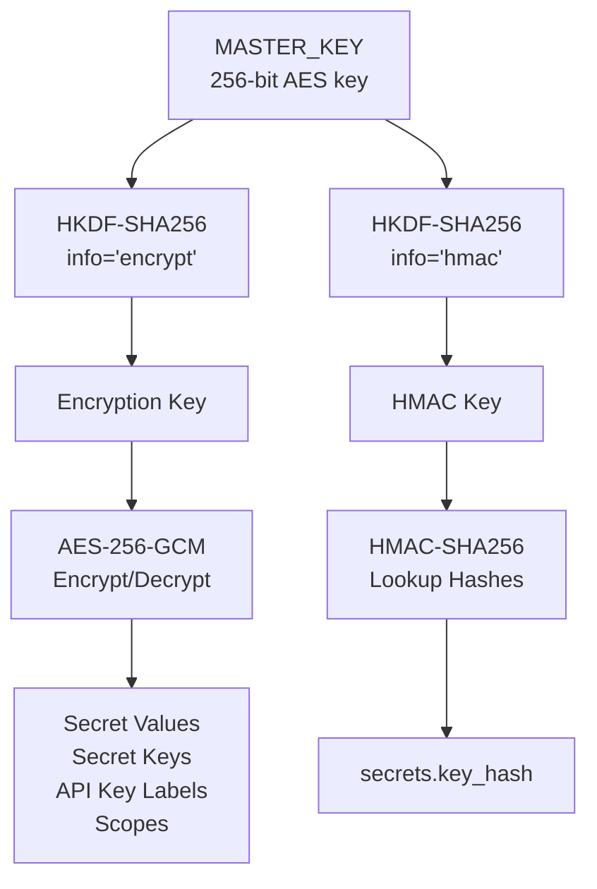
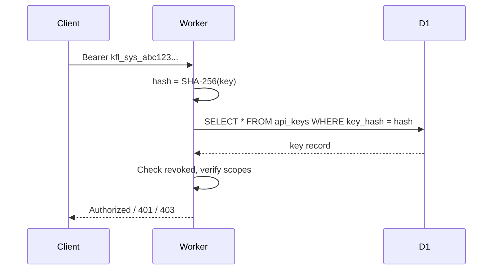

# Encryption

Keyflare uses industry-standard encryption algorithms via the Web Crypto API.

## Overview



## Master Key

The **MASTER_KEY** is the single root of trust:

- **Storage:** Cloudflare Worker Secret
- **Format:** Base64-encoded 256-bit (32-byte) key
- **Set via:** `wrangler secret put MASTER_KEY`
- **Lives in:** Worker runtime memory only

### Key Derivation (HKDF)

We use **HKDF** to derive two separate keys from the master key:

```
Encryption Key = HKDF-SHA256(MASTER_KEY, info="encrypt")
HMAC Key       = HKDF-SHA256(MASTER_KEY, info="hmac")
```

This separation ensures that even if the HMAC key were exposed, the encryption key remains independent.

## AES-256-GCM Encryption

All sensitive data is encrypted with **AES-256-GCM** (Galois/Counter Mode).

### Encryption Process

```
Encrypt(plaintext):
    iv         = crypto.getRandomValues(12 bytes)
    key        = derived encryption key
    { ciphertext, tag } = AES-256-GCM.encrypt(key, iv, plaintext)
    stored     = base64(iv || ciphertext || tag)
```

### Decryption Process

```
Decrypt(stored):
    raw        = base64_decode(stored)
    iv         = raw[0..12]
    ciphertext = raw[12..n-16]
    tag        = raw[n-16..n]
    plaintext  = AES-256-GCM.decrypt(key, iv, ciphertext, tag)
```

### What Gets Encrypted

| Data | Encryption |
|------|------------|
| Secret values | AES-256-GCM |
| Secret key names | AES-256-GCM |
| API key labels | AES-256-GCM |
| System key scopes | AES-256-GCM (JSON array) |

### Why GCM?

- **Authenticated encryption** — Detects tampering
- **Native to Web Crypto API** — No dependencies
- **Fast** — Hardware acceleration on most platforms
- **12-byte IV** — Standard for GCM, random per encryption

## HMAC-SHA256 for Lookups

To find records by name without storing plaintext, we use **HMAC-SHA256**:

```
LookupHash(name):
    key  = derived HMAC key
    hash = HMAC-SHA256(key, name)
    return hex(hash)
```

### Use Case: Secret Key Lookup

```
secrets.key_hash = HMAC-SHA256(hmac_key, "DATABASE_URL")
```

This allows:
- Looking up secrets by key name
- Deduplication (same key name = same hash)
- No plaintext key names in database

### Why HMAC (not plain hash)?

- **Keyed** — Requires the HMAC key to compute
- **Deterministic** — Same input always produces same output
- **Not reversible** — Cannot recover name from hash without key

## API Key Hashing

API keys are hashed with **SHA-256** for storage:

```
key_hash = SHA-256(full_api_key)
```

### Storage Strategy

```
┌─────────────────────────────────────────────────────────┐
│ API Key Creation                                         │
│                                                         │
│   Full key: kfl_sys_a1b2c3d4e5f6a7b8c9d0e1f2a3b4c5d6   │
│                                                         │
│   ├── key_prefix = "kfl_sys_a1b2"                       │
│   │   (first 12 chars, stored plaintext for display)    │
│   │                                                     │
│   └── key_hash = SHA-256(full_key)                      │
│       (stored in D1, used for auth lookup)              │
└─────────────────────────────────────────────────────────┘
```

### Authentication Flow



### Why SHA-256 (not Argon2id)?

| Property | API Keys | Passwords |
|----------|----------|-----------|
| Entropy | 128 bits | ~40 bits |
| Attack | Brute-force keyspace | Dictionary attack |
| Hash choice | Fast (SHA-256) | Slow (Argon2id) |

API keys have 128 bits of entropy, making brute-force infeasible regardless of hash speed. SHA-256 is native and adds zero dependencies.

## Summary

| Component | Algorithm | Purpose |
|-----------|-----------|---------|
| Master key | 256-bit random | Root of trust |
| Key derivation | HKDF-SHA256 | Derive encryption + HMAC keys |
| Data encryption | AES-256-GCM | Encrypt secrets, labels, scopes |
| Lookup hashing | HMAC-SHA256 | Deterministic keyed lookups |
| API key hashing | SHA-256 | Store key hashes for auth |

<h2 noAnchor>Next Steps</h2>

<CardGroup cols={2}>
  <Card href="/api-reference" title="API Reference">
    Explore the Keyflare API endpoints.
  </Card>
  <Card href="/cli/overview" title="CLI Reference">
    Learn the kfl CLI commands.
  </Card>
</CardGroup>
