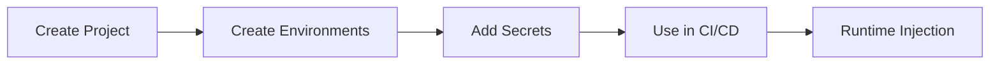

# Projects & Environments

Keyflare organizes secrets using a simple hierarchy: **Projects → Environments → Secrets**.

## Projects

A project is a namespace for related secrets. For example:
- `my-api` — Backend API secrets
- `frontend` — Frontend application secrets
- `worker` — Background worker secrets

### Create a Project

```bash
# Create a project with default environments (Dev, Prod)
kfl projects create my-api

# Create a project without default environments
kfl projects create my-api --environmentless
```

<Note>
  New projects get two default environments (**Dev** and **Prod**) unless you use `--environmentless`.
</Note>

### List Projects

```bash
kfl projects list
```

Output:
```
NAME           ENVIRONMENTS  CREATED
my-api         2             2024-01-15
frontend       2             2024-01-16
worker         3             2024-01-17
```

### Delete a Project

```bash
kfl projects delete my-api
```

<Warning>
  Deleting a project removes **all** environments and secrets. This cannot be undone.
</Warning>

## Environments

Each project contains environments (also called "configs"). Common environment names:
- `development` / `dev`
- `staging` / `stage`
- `production` / `prod`

### Create an Environment

```bash
kfl configs create staging --project my-api
```

### List Environments

```bash
kfl configs list --project my-api
```

Output:
```
CONFIG        SECRETS  LAST UPDATED
development   12       2024-01-17
staging       12       2024-01-17
production    15       2024-01-18
```

### Delete an Environment

```bash
kfl configs delete staging --project my-api
```

<Warning>
  Deleting an environment removes **all** secrets in that environment.
</Warning>

## Typical Workflow



### Example: New Project Setup

```bash
# 1. Create the project
kfl projects create my-api
# ✓ Project "my-api" created with environments: Dev, Prod

# 2. Add a staging environment
kfl configs create staging --project my-api
# ✓ Config "staging" created in project "my-api"

# 3. Add secrets to each environment
kfl secrets set DATABASE_URL=postgres://dev... --project my-api --config Dev
kfl secrets set DATABASE_URL=postgres://stage... --project my-api --config staging
kfl secrets set DATABASE_URL=postgres://prod... --project my-api --config Prod

# 4. Verify
kfl configs list --project my-api
# CONFIG      SECRETS  LAST UPDATED
# Dev         1        2024-01-17
# Prod        1        2024-01-17
# staging     1        2024-01-17
```

## Next Steps

<CardGroup cols={2}>
  <Card title="Manage Secrets" href="/guides/secrets">
    Add, update, and retrieve secrets.
  </Card>

  <Card title="API Keys" href="/guides/api-keys">
    Create scoped keys for CI/CD and services.
  </Card>
</CardGroup>
